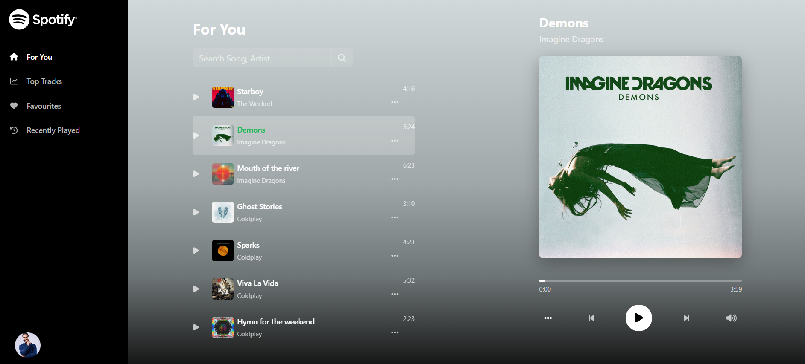

# Music Player Application - Dhairyasheel Ingale

A modern, responsive music player web application built with React that offers a seamless music listening experience with dynamic UI elements and personalized features.

## Live Demo

👉 [Check out the live app here](https://musicplayer-application.netlify.app/)


## Features

- **Dynamic Background**: Background color adapts to the album art of the currently playing song  
- **Music Library**: Browse through a collection of songs  
- **Search Functionality**: Search for songs by title or artist  
- **Favorites**: Add songs to your favorites for quick access  
- **Recently Played**: Keep track of your listening history  
- **Responsive Design**: Works on desktop and mobile devices  
- **Music Controls**: Play, pause, skip, and control volume  
- **Sidebar Navigation**: Easy access to different sections of the app  

## Tech Stack

- React.js  
- React Bootstrap for UI components  
- Context API for state management  
- SCSS for styling  
- FontAwesome for icons  
- Local Storage for persisting user preferences  

## Project Structure

music-player/
├── public/
│   ├── index.html
│   └── assets/
├── src/
│   ├── components/
│   │   ├── Layout/
│   │   ├── MusicItem/
│   │   ├── MusicPlayer/
│   │   ├── Sidebar/
│   │   └── ...
│   ├── context/
│   │   └── MusicContext.jsx
│   ├── data/
│   │   └── musicData.js
│   ├── pages/
│   │   ├── Home.jsx
│   │   ├── Favorites.jsx
│   │   └── ...
│   ├── utils/
│   │   ├── colorExtractor.js
│   │   └── storageUtils.js
│   ├── App.jsx
│   └── index.js
└── package.json


## Getting Started

### Prerequisites

- Node.js (v14 or later)  
- npm or yarn  

### Installation

1. Clone the repository  
   ```bash
   git clone https://github.com/yourusername/music-player.git
   cd music-player
2. Install Dependensies
   ```bash
   npm install
3. Start the development server
   ```bash
   npm start
4. Open your browser and navigate to http://localhost:3000

## Usage

  - Browse Music: Navigate to the Home page to see all available songs

  - Play a Song: Click on a song to play it

- Add to Favorites: Click the ellipsis (...) next to a song and select "Add to Favorites"

- View Favorites: Click on "Favorites" in the sidebar to view your favorite songs

- Search: Use the search bar to find songs by title or artist

- Player Controls: Use the player controls to play/pause, skip tracks, and adjust volume

## Customization
### Adding more songs
To add more songs to the library, edit the src/data/musicData.js file:
  ```bash
const musicData = [
  {
    id: "unique-id",
    title: "Song Title",
    artistName: "Artist Name",
    thumbnail: "/path/to/thumbnail.jpg",
    musicUrl: "/path/to/song.mp3",
    duration: "3:45"
  },
  // Add more songs here
];
```
### Changing Theme Colors
The application uses dynamic colors based on album art, but you can modify the base theme in the SCSS files.

## Contributing
Contributions are welcome! Please feel free to submit a Pull Request.
1. Fork the repository
2. Create your feature branch
```bash
git checkout -b feature/amazing-feature
```
3. Commit your changes
```bash
git commit -m 'Add some amazing feature'
```
4. Push to the branch
```bash
git push origin feature/amazing-feature
```
5. Open a Pull Request

## Acknowledgements
- Music samples from dummy data

- Icons from FontAwesome

- UI inspiration from Spotify and Apple Music

## Conclusion
Thank you for reviewing my submission. I look forward to your feedback!

## Web Page Screenshots
**1.**
 **For You Page**
   - The "For You" page provides personalized music recommendations based on your listening habits. It showcases a curated selection of songs that match your taste, featuring new releases and trending tracks that align with your preferences.
   
 

 ---

**2.** 
 **Top Tracks Page**
- The "Top Tracks" page displays the most popular songs in your music library. These tracks are ranked based on play count or other metrics, giving you quick access to the hottest and most listened-to music in the collection.

 


---

**3.** 
 **Favorites Page**
- The "Favorites" page shows all the songs you've marked as favorites by clicking the heart icon. This creates your personal collection of preferred tracks that you can easily access without searching through the entire library.

 


---

**4.** 
 **Recently Played Page**
- The "Recently Played" page keeps track of your listening history, showing the songs you've played most recently in chronological order. This makes it easy to revisit tracks you enjoyed recently without having to search for them again.

 


---
